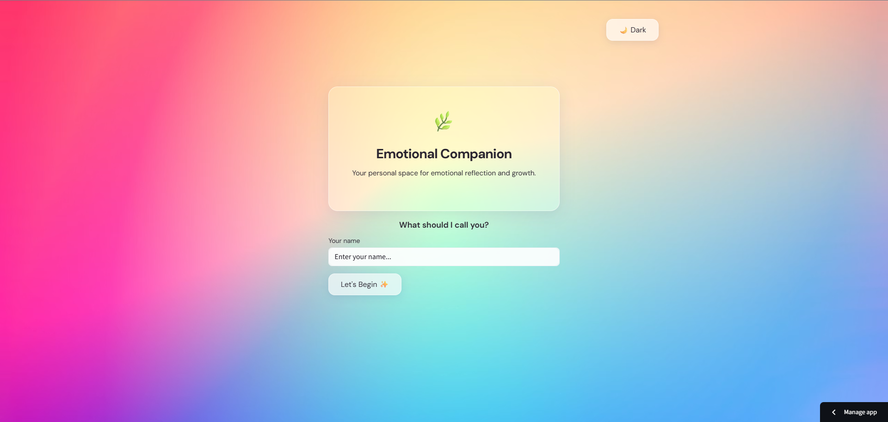
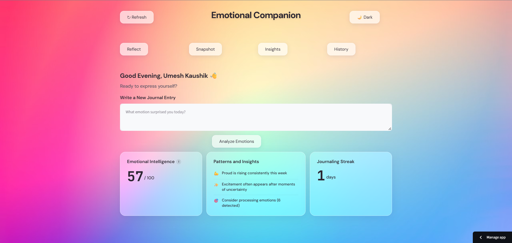
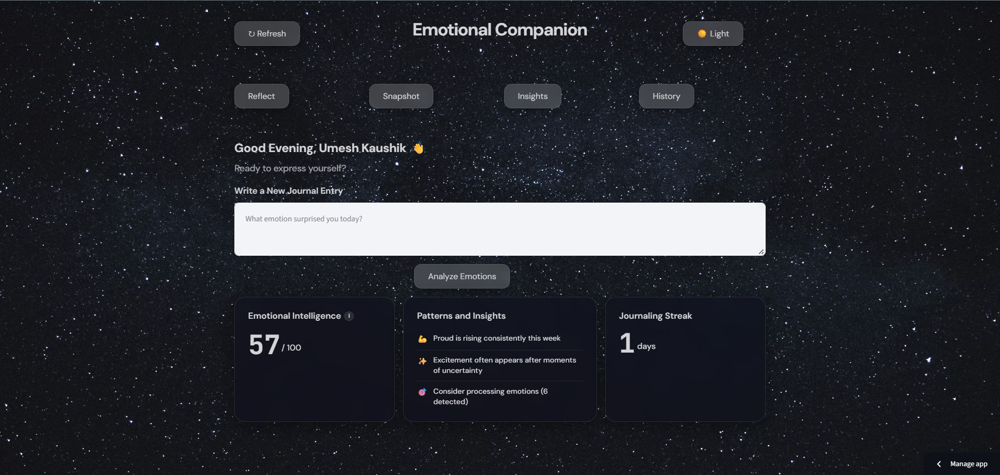
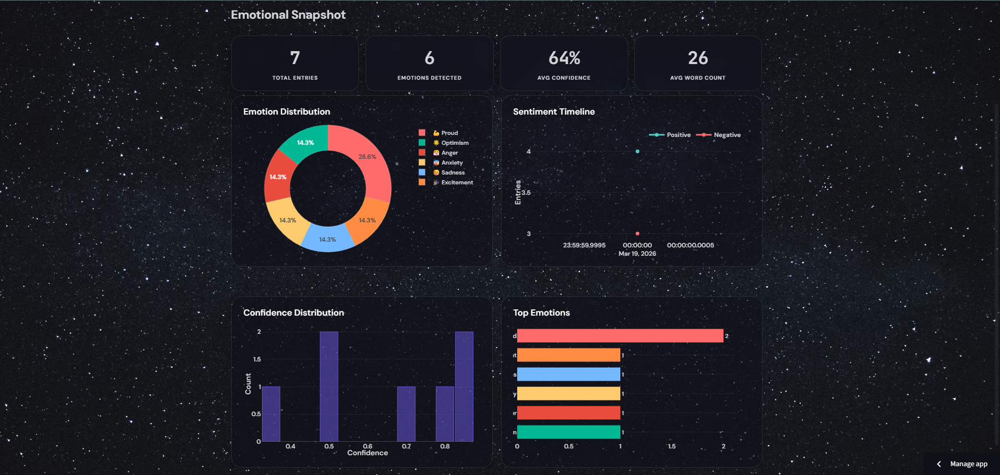
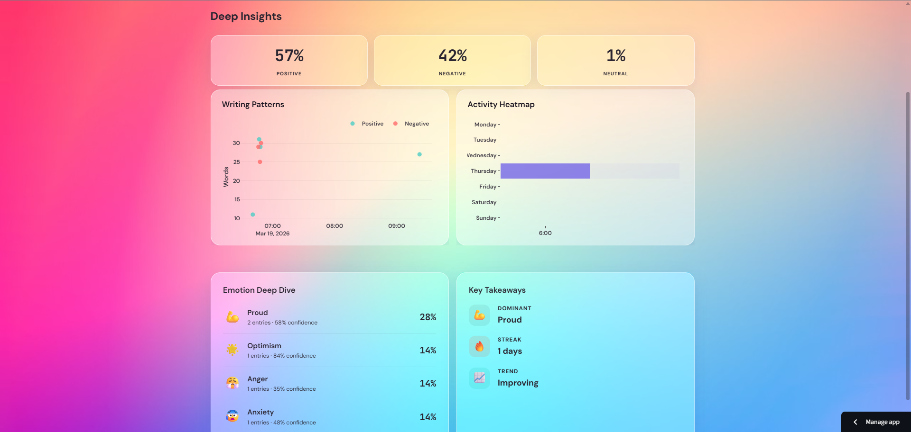
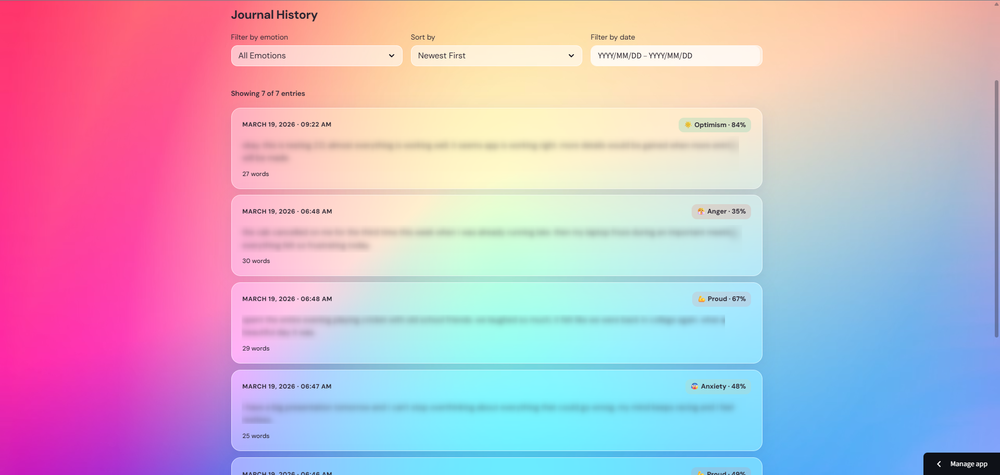

# 🌿 Emotional Intelligence Companion

A full-stack emotional journaling application that uses a **custom fine-tuned DistilBERT model** to classify emotions from journal entries in real-time, with a glassmorphism UI and interactive analytics dashboard.

> **No external AI APIs.** The emotion detection model was fine-tuned from scratch as part of this project — no OpenAI, Google, or any third-party AI service is used. The entire ML pipeline (data processing, model training, inference) is self-contained.

**🔗 [Live Demo](https://emotion-detection-kki5h6c3numuk8syg4zlvf.streamlit.app/)**

---

## What It Does

Write a journal entry → the app analyzes your emotions using a custom fine-tuned NLP model → view insights, trends, and patterns over time through interactive visualizations.

The app detects **17 emotions** including joy, sadness, anger, anxiety, gratitude, excitement, fear, and more — going beyond simple positive/negative sentiment analysis.

---

## Tech Stack

| Layer | Technology |
|-------|-----------|
| **Frontend** | Streamlit, Plotly, Custom CSS (Glassmorphism) |
| **ML Model** | DistilBERT (fine-tuned), PyTorch, Hugging Face Transformers |
| **Database** | PostgreSQL (Supabase) |
| **ETL Pipeline** | Python (Medallion Architecture — Bronze/Silver/Gold) |
| **Deployment** | Streamlit Community Cloud |
| **Model Hosting** | Hugging Face Hub |

---

## Architecture

```
User Input (Journal Entry)
        │
        ▼
┌─────────────────────┐
│   Streamlit App      │  ← Glassmorphism UI with light/dark mode
│   (dashboard/app.py) │
└────────┬────────────┘
         │
         ▼
┌─────────────────────┐
│   ETL Pipeline       │  ← Text cleaning, validation, quality scoring
│   (src/etl/)         │
└────────┬────────────┘
         │
         ▼
┌─────────────────────┐
│   DistilBERT Model   │  ← Fine-tuned on 59K samples (GoEmotions + Emotion datasets)
│   (src/ml/)          │     17 emotions, ~63% test accuracy
└────────┬────────────┘
         │
         ▼
┌─────────────────────┐
│   PostgreSQL         │  ← Medallion architecture (Bronze → Silver → Gold)
│   (Supabase Cloud)   │     Raw entries → Processed → Predictions → Analytics
└─────────────────────┘
```

---

## Features

### 🏠 Welcome Screen

Users are greeted with a personalized name prompt. Enter your name and the app loads your previous journal data automatically.



---

### 📝 Reflect — Journal Entry & Emotion Analysis

The core experience. Write a journal entry, hit Analyze, and get real-time emotion detection with confidence scores. The page also shows your Emotional Intelligence score (0–100), detected patterns, and journaling streak.





---

### 📊 Snapshot — Emotional Overview

A visual dashboard with emotion distribution (donut chart), sentiment timeline, confidence histogram, and top emotions bar chart. All charts are interactive via Plotly.



---

### 🔍 Insights — Deep Analysis

Positive/Negative/Neutral ratio breakdown, writing patterns, activity heatmap (day × hour), emotion deep dive with per-emotion stats, and key takeaways with trend analysis.



---

### 📖 History — Journal Timeline

Full journal history with filters by emotion, date range, and sort order. Each entry shows the detected emotion tag with confidence percentage.



---

### 🎨 Light & Dark Mode

Glassmorphism design with backdrop blur effects, responsive glass cards with hover animations, and a custom color palette per emotion. Toggle between a warm gradient (light) and a starfield (dark) theme.

| Light Mode | Dark Mode |
|-----------|----------|
|  |  |

---

## Model Performance

The emotion classifier is a **self fine-tuned model** — no external AI APIs (OpenAI, Google, etc.) are used anywhere in this project. The model was fine-tuned on a combined dataset and handles 17 distinct emotions.

**Overall Metrics:**
- **Overall Accuracy:** ~63% across all 17 emotion classes
- **Training Data:** ~59,000 samples (GoEmotions + Emotion datasets combined)
- **Base Model:** `distilbert-base-uncased` fine-tuned for sequence classification
- **Training:** 3 epochs on Google Colab (T4 GPU), PyTorch
- **Hosted on:** [Hugging Face Hub](https://huggingface.co/umeshkaushik610/emotion-classifier)

**Performance by Emotion Category:**

| Tier | Accuracy Range | Emotions |
|------|---------------|----------|
| **Strong** | 80–90% | Joy, Sadness, Anger, Fear, Excitement, Gratitude |
| **Moderate** | 60–70% | Anxiety, Disappointment, Optimism, Pride/Proud |
| **Weaker** | 40–50% | Embarrassment, Guilt, Confusion, Neutral, Annoyance |

The model performs best on commonly expressed, well-represented emotions in the training data. Rarer and more nuanced emotions (embarrassment, guilt) have fewer training samples and are inherently harder to distinguish from neighboring emotions, which is consistent with published benchmarks on the GoEmotions dataset. The overall accuracy of ~63% across 17 classes is competitive — for context, random guessing on 17 classes would yield ~6%, and even state-of-the-art models on GoEmotions report 60–70% macro F1.

---

## Database Schema (Medallion Architecture)

- **Bronze Layer** — `raw_journal_entries`: Raw text as entered by user
- **Silver Layer** — `processed_entries`: Cleaned text, word count, quality score
- **Gold Layer** — `emotion_predictions`: Predicted emotion, confidence, model version
- **Analytics** — `daily_emotion_summary`, `emotion_trends`: Aggregated insights

---

## Project Structure

```
├── dashboard/
│   └── app.py                 # Main Streamlit application
├── src/
│   ├── database/
│   │   ├── connection.py      # PostgreSQL connection (Supabase/local)
│   │   ├── operations.py      # CRUD operations
│   │   └── schema.sql         # Database schema
│   ├── etl/
│   │   ├── pipeline.py        # End-to-end ETL pipeline
│   │   └── transform.py       # Text cleaning and validation
│   ├── ml/
│   │   ├── inference.py       # Model loading and prediction (HF Hub/local)
│   │   └── batch_predict.py   # Batch prediction utilities
│   └── reporting/
│       ├── aggregations.py    # Data aggregation logic
│       └── report_gen.py      # Report generation
├── screenshots/               # App screenshots for README
├── data/
│   └── models/                # Model config and tokenizer (weights on HF Hub)
├── requirements.txt
└── README.md
```

---

## Run Locally

```bash
# Clone the repo
git clone https://github.com/umeshkaushik610/emotion-detection.git
cd emotion-detection

# Create virtual environment
python -m venv venv
source venv/bin/activate  # Windows: venv\Scripts\activate

# Install dependencies
pip install -r requirements.txt

# Set up environment variables
# Create a .env file with:
# DB_HOST=localhost
# DB_PORT=5432
# DB_NAME=emotion_detection_db
# DB_USER=postgres
# DB_PASSWORD=your_password

# Set up the database
psql -U postgres -d emotion_detection_db -f src/database/schema.sql

# Run the app
streamlit run dashboard/app.py
```

---

## What I Learned

- Fine-tuning transformer models (DistilBERT) for multi-class classification with PyTorch
- Building end-to-end ETL pipelines with a medallion architecture
- Deploying ML models via Hugging Face Hub for cloud inference
- Cloud PostgreSQL setup with Supabase
- Streamlit deployment with secrets management
- Custom CSS injection for glassmorphism UI in Streamlit

---

## Roadmap

Planned improvements for future iterations:

- **User Authentication** — Add proper login/signup with password hashing so users can securely access their data across devices, replacing the current name-based identity system
- **Model Retraining with User Feedback** — Allow users to correct misclassified emotions, collect that feedback, and use it to fine-tune the model for improved accuracy over time
- **Weekly/Monthly Email Reports** — Automated emotional wellness summaries delivered via email, with trend analysis and personalized recommendations
- **Multilingual Support** — Extend emotion detection to Hindi and Hinglish journal entries using multilingual transformer models (XLM-RoBERTa)
- **Export & Data Portability** — Let users export their journal history and analytics as PDF reports or CSV files for personal records or therapist sharing

---

## Author

**Umesh Kaushik**

Built as a portfolio project demonstrating full-stack data engineering and applied ML skills.
